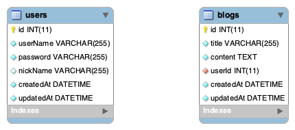

# Blog in Node.js (Express and Koa2)

## Introduction

Here I will use pure Node.js, Express.js and Koa2.js to complete the blog project, which only only focus on the server-end. This project includes four directories, which are Blog-Node, Blog-Express, Blog-Koa and Front-End-View, respectively.

Firstly, I use pure Node.js to create the blog server, in order to dig the intrinsic node-server knowlodge, where I mix in many necessary skills, including mysql database to store data, redis to store session, nginx to cross front-end and server-end, log to recorde logs, xss and escape to avoid attack, crypto to encrypt password, pm2 to manage node process.

Secondly, I will reuse some coding in Express and Koa2 framework to completely quickly the blog project again by some existed modules known how to work before in the pure node project.

Thirdly, I build one basic front-end project, let it get the data in realtime from backend through ajax and jquery simply.

The purpose of project is to familiar with the node server working principle, and can use kinds of skills masterly to satisfy with customer needs.

## Tech Proposal

1. Create Server by node.js;
2. Create database by MySQL datbase;
3. Create Front-end view by jquery and ajax;
4. Establish connection between server and database;
5. Create Redis for storing session;
6. Use nginx to reverse proxy the server and front end;
7. Create methods to avoid attacks and record the logs;
8. Use pm2 in 'prod' environment.

## Project Process

### Pure node.js

In this porject, I firstly create the completed server by the pure node.js and query the data from mySQL database, and let front end get data from database through server.

I create server in file of _'bin/www.js'_, in which I import server inner logic application funcion 'serverHandler' in 'app.js'; while in the 'app.js' file, I deal with post method by one seperated function named 'handlePostData', and deal with router of _'blog'_ and _'user'_ by two external functions named _'handleBlogRouter'_ and _'handleUserRouter'_. In one word, _'serverHandler'_ in _'App.js'_ is the general function to realize the server logic application, and all details will bring out to _'handleBlogRouter'_ and _'handleUserRouter'_, in _'router'_ directory respectively.

In the router directory, the server will confirm the url by 'req.method' and 'req.path' display the different contents. On the specific url and method, the server will call the specific metod created in _'controller'_ directory. Normally front-end and server-end communicate data by some existed format, so I create some specific mode to store these format in _'model'_ directory.

In these controller methods, I will trigger sql language exported, from _'mysql.js'_ in _'db'_ directory, to communicate with mysql database to get data in realtime, after which I will return these data in assigned format on the front-end.

In this blog project, I will use some existed user whose username and password stored in mysql database to login the blog and create, update and delete his own blog articles, so I will use cookie and sessioin to store the username infomation. Because of the limitation of session, I will store the sessions on redis server, so that all node server processes can visit them. I create the 'req.cookie' and 'req.session' in _'app.js'_, and store the _'req.session'_ in redis by _'redis.js'_ in _'db'_ directory.

Security is always the utmost important for network, so I use XSS module and 'escape' method to avoid these attacks, and also use _'crypto'_ module to encrypt the password existed in _'cryp.js'_ in _'utils'_ directory. Record the logs can be easily for the staff to know how the server works well or what happend after the server broke down. I also create method in _'log.js'_ in _'utils'_ to record the logs. I can select different methods to record logs in 'dev' and 'prod' environment. pm2 is a process management tool, I will use it in 'prod' environment.

After all the process to complete the blog project, I master the basic skills and also know the intrinsic knowledge how to build one self-contained node server project.

### Express.js

In the Blog-Express directory, I create the same blog project, in which I use express.js for server and same Front-End-View pages. Here I still use _'controller'_, _'model'_, _'utils'_, _'config'_ and _'db'_ directories.

Because Express already mixin with some modules, so I donot need to create all the fuctions myself, I can import 'express-session' and 'connect-redis' to create session and store it in redis. I also can use 'morgan' to record logs, all of which can be applied in _'app.js'_. Express can use middleware to create the chain programming, so I create the _'loginCheck.js'_ in _'middleware'_ directory, which can be used in methods in 'controller' directory to confirm the user login or not.

### Koa2.js

Similar as Express.js project, I still can use some coding in _'controller'_, _'model'_, _'utils'_, _'config'_ and _'db'_ directories. But Koa2 use **'async'** and **'await'** to void callback hell, so I modify the methods in methods in _'controller'_ _'router'_ directories. I also import 'koa-generic-session', 'koa-redis', 'koa-morgan' to create session and store it in redis.

All of the three projects I use nginx to connect server-end and front-end by avoiding cross-domain problems. and also use pm2 to manage node server process in environments.

## Project Display

Take Blog-Koa project as an example, in order to display the project well, we need to pull the project to local
by `git clone git@github.com:rick-liyue-huang/Blog-NodeJs.git`,
and then `cd Blog-NodeJs/Blog-Koa`, to enter the three directories, and run `npm i` to install all the modules.

Becaus this server and database run in the local, I have to create the database in local environment. I use mysql database and create the 'myblog1' database and then create 'blogs' and 'users' table to store the blogs and user data. Here has one **notice: I will use the encrypted password, so I will store the encrpted password in 'users' table.**, the password for 'myblog1' is 'password', we can refer the _'config/db.js'_ file. In Mac, I normally download mysql, config it by 'MySQLWorkBench' and start it.

We also need to use redis and nginx, I will run `brew install redis` and run `brew install nginx` in Mac to install them, by the way we also need to configurate _'/usr/local/etc/nginx/nginx.conf'_ to visit the 'localhost:8088' to display pages. Front-end is stored in 'Front-End-View' directory, so we run `cd Front-End-View` and run `http-server -p 8001` to start the front-end pages, which display in 'localhost:8001'. I set the server port as 8000 in _'bin/www.js'_. Thus, 'localhost:8088/api/_/_' will display server-end, 'localhost:8001/' will display front-end, the general display will on route of 'localhost:8088/'.

## One More word

从输入地址到返回内容：
DNS 解析，建立 TCP 连接，发送 HTTP 请求
server 接收到 HTTP 请求，处理，并返回
客户端接收到返回数据，处理数据，如渲染页面执行 js

database:

show databases;

use myblog;

show tables

insert into users (username, `password`, realname) values ('rick', '666', 'huangliyue');

select \* from users;

select \* from users where username='rick';

select id from users where username like '%e%';

select \* from users order by id desc;

update users set realname='liyue' where id=1;

SET SQL_SAFE_UPDATES=0;

delete from users where username='rick';

select \* from users where state<>0;

alter user 'root'@'localhost' identified with mysql_native_password by 'moon978329';

## cookie session

cookie 是存储在浏览器的一段字符串
跨域不共享
格式如 k1=v1;k2=v2;k3=v3; 因此可以存储结构化数据
每次发送 HTTP 请求，会将请求域的 cookie 一起发送给 server
server 可以修改 cookie 并且可以返回给浏览器
浏览器也可以通过 javascript 修改 cookie

cookie 总存储 userid,server 端对应 username
session 解决的问题：
因为暴露敏感信息，需要隐藏
session 直接是 js 变量，放在 nodejs 的进程内存中
第一，进程内存有限，访问朗过大，内存暴增怎么办
第二，正式线上运行时多进程，进程之间内存无法共享

web server 最常用额缓存数据库，数据存放在内存中
相比 MySQL，访问速度快
成本过高，可存储的数据量更小
将 web server 和 Redis 拆分为两个单独的服务
双方都是独立的，都是可扩展的

session 访问频繁，对性能要求高
session 可以不考虑断电丢失数据的问题
session 数据量不会太大

为何网站数据不适合 Redis
操作频率不是太高
断电不能丢失，必须保留
数据量大，内存成本高

## Redis

`brew install redis`
directory
'/usr/local/Cellar/redis/5.0.6: 13 files, 3.1MB'

`redis-server` `redis-cli`

set key val
get key
keys \*
del key

## 前后端同域联调

登录功能依赖 cookie，必须用浏览器来联调
cookie 跨域不共享，前端和 server 必须同域
用 nginx

npm run i --save -g http-server

nginx 是 web 服务器，开源免费
一般做静态服务，负载均衡
反向代理

`brew install nginx`

config file:
'/usr/local/etc/nginx/nginx.conf'
test: `nginx -t`
run: `nginx`
reload: `nginx -s reload`
stop: `nginx -s stop`

in '/usr/local/etc/nginx/nginx.conf'

```
location / {
         proxy_pass  http://localhost:8001;
}

location /api/ {
   proxy_pass  http://localhost:8000;
   proxy_set_header Host $Host;
}
```

## log

日志放到文件中
文件很大： 因此放到文件中

## crontab

定时任务
设置定时任务， 格式 **\***command
将 access.log 拷贝重命名为日期.access.log
清空 access.log,继续积累日志

pwd the log path
`/Users/mac/Documents/gitgarden/Blog-NodeJs/Blog-Node/logs`
create copy.sh

`crontab -e`
to run
`* 0 * * * sh /Users/mac/Documents/gitgarden/Blog-NodeJs/Blog-Node/src/utils/copy.sh`

`crontab -l` to check list

### pm2

install by `npm install pm2 -g`
check pm2 by `pm2 --version`

`pm2 list` to check

`pm2 start`
`pm2 restart`
`pm2 stop`
`mp2 delete`
`pm2 log`
`pm2 monit`

```
{
  "apps": {
    "name": "pm2-test-server",
    "script": "app.js",
    "watch": true, // 监听变化自动重启
    "ignore_watch": [ // 忽略一些文件的变化
      "node_modules",
      "logs"
    ],
    "instances": 2, //
    "error_file": "logs/err.log", // 错误日志放到哪里
    "out_file": "logs/out.log", // 输出日志放到哪里
    "log_date_format": "YYY-MM-DD HH:mm:ss" // 日志时间
  }
}
```

here create 'pm2.config.json' file

进程守候：出现错误就会进程重新启动，并且记录错误
配置文件：进程数量，日志文件目录
多进程：操作系统有很多进程，但是会限制每个进程的大小，单个进程是受限的，因为如果进程崩溃，就会有问题，单个进程的内存是受限的
内存无法充分利用多核 CPU 的优势
多进程之间内存无法共享
多进程之间可以通过访问 redis 来实现数据共享

## new blog by koa2

### about router

firstly, install koa2 with ejs by `koa2 -e Blog-New`

deal with params in url on 'GET' method

```
router.get('/loadMore/:username/:pageIndex', async (ctx, next) => {
  const { username, pageIndex } = ctx.params;
  ctx.body = {
    title: `this is profile page of ${username} and ${pageIndex}!!`
  }
})

```

deal with params in body on 'POST' method

```
router.post('/login', async (ctx, next) => {
  const { username, password } = ctx.request.body;
  ctx.body = {
    username,
    password
  }
});
```

### about ejs

`<%= locals.name %>` for some default variable

```
<% if(locals.isMe) { %>
        <a href="#">@ me</a>
      <% } else { %>
        <button>follow</button>
      <% } %>
```

for the condition statement

```
<%- include('widgets/user-info.ejs', {
      isMe
    }) %>
```

for ejs import, also can import javascript

```
<ul>
  <% blogList.forEach(blog => { %>
    <li data-id='<%= blog.id %>'><%= blog.title %></li>
  <% }) %>
</ul>
<script>
  console.log(100);
</script>

```

for thie loop statement

also can write script tag for javascript

### about mysql and workbench

password: 'abc123456'

`show databases;`

`use newmyblog;`

'select count(id) as `count` from blogs ' check blogs length

`select * from blogs order by id desc limit 2 offset 3;` start from 3 and show 2 blogs one page

外键 foreign key:

了解 外键的创建 以及如何关联

链表查询

`select * from blogs inner join users on users.id=blogs.userid;`

`select blogs.*, users.username, users.nickname from blogs inner join users on users.id=blogs.userid;`

`select blogs.*, users.username, users.nickname from blogs inner join users on users.id=blogs.userid where users.username='rick';`

ORM - object relational mapping

建模（外键） & 同步到数据库

数据表， 用 js 中的模型 （class or object） 代替
一条或者多条记录，用 js 中一个对象或者数组代替
sql 语句用对象方法代替

using sequelize to connect database and create 'users' table, 并且创建了 createdAt and updatedAt.

its better to write down these two ways together.

```
Blog.belongsTo(User, {
  // create foreign key Blog.userId -> User.id
  foreignKey: 'userId'
});

User.hasMany(Blog, {
  foreignKey: 'userId'
});
```

know how to create eer diagram.



### about redis

注意：用 ctx.session 来启动 session

### jest 单元测试

单个功能或者接口，给定输入，得到输出，看输出是否符合预期
需要手动编写用例代码，然后统一执行
能一次性执行所有的单元测试，短时间内验证所有功能是否正常

意义： 在老系统里面编写新代码，对新代码编写单元测试，然后统一跑一遍，看看是否得到

使用 jest 在 .test.js 里面编写用例；

`npm i --save-dev jest supertest`
`"test": "cross-env NODE_ENV=test jest --runInBand --forceExit --colors"`

### 开发环境搭建

创建 db 文件夹

in 'seq.js'

```
/ if on test environment, donot print matched sql statement
if(isTest) {
  conf.logging = () => {}
}
```

配置 eslint, 以及 pre-commit
create '.eslintrc.json' and '.eslintignore' file
add `"lint": "eslint --ext .js ./src"` in package.json

在提交之前控制语法
`npm i --save-dev pre-commit` 并且

```
"pre-commit": [
  "lint"
]å
```

inspect 调试: 就是利用 Chrome 浏览器的方式来调试 node.js 代码
`"dev": "cross-env NODE_ENV=dev ./node_modules/.bin/nodemon --inspect=9229 bin/www",`

and input `chrome://inspect/` in chrome browser

404 页面和错误页

明白 view 文件夹之间的 ejs 之间互相的引用

在 routers 里面建立两个文件夹，view 是针对页面， api 是针对前后端接口

## jwt -- json web token

用户认证成功后，server 端返回一个加密的 token 给客户端
客户端后续每次请求都带 token,以示当前身份

jwt 用户信息加密存储在客户端，不依赖 cookie，可跨域

大型系统两者可共用
jwt 更适用于服务节点比较多，跨域比较多的系统，不需要 redis
session 更适用于统一的 web 服务，server 要严格管理用户信息

## 技术方案设计

架构设计
页面（模板，路由）和 api 设计

数据模型设计

其他的方案设计

@功能如何实现
图片上传如何实现

原型图演示

关系型数据库三大范式
属性的原子性： 每一列都不可以再拆分
记录的唯一性：有唯一的主键，其他的属性都依赖这个主键
字段的冗余性：不存在数据冗余和数据依赖 （引用用外键）

功能列表

用户管理

用户设置

创建微博

个人主页，显示个人微博列表和个人信息，
广场页，使用缓存
关注和取消关注，
首页
@和回复
@提到我的

用户管理：
页面：模板和路由
数据建模
开发注册功能
开发登录功能
抽离 logincheck 中间件
单元测试

注册 /api/user/register
/api/user/isExist

登录
/api/user/login

在该分支下处理用户登录
`git checkout -b newblog-feature-login`

开发注册功能
回顾技术方案
开发注册接口
密码加密 用户信息验证

json-schema to 校验用户数据
使用 ajv

创建单元测试来验证全部的用户部分
单元测试是真实的来操作数据，因为是在 test 环境，因此没有污染数据

返回 master
`git checkout master`
`git pull origin master`
`git merge newblog-feature-login`
`git push origin master`
newblog-feature-login

DNS 解析，建立 TCP 连接，发送 http 请求
server 接收到 http 请求，处理，并返回
客户端接收到返回数据，处理数据

```
const fs = require("fs");
const path = require("path");

// 普通方法

function getFileConent(fileName, callback) {
  const fullFileName = path.resolve(__dirname, fileName);
  fs.readFile(fullFileName, (err, data) => {
    if (err) {
      console.log(err);
      return;
    }
    callback(JSON.parse(data.toString()));
  });
}

getFileConent("a.json", aData => {
  console.log(aData);
  getFileConent(aData.next, bData => {
    console.log(bData);
    getFileConent(bData.next, cData => {
      console.log(cData);
    });
  });
});

// promise
function getFileConentPromise(filename) {
  const promise = new Promise((resolve, reject) => {
    const fullFileName = path.resolve(__dirname, filename);
    fs.readFile(fullFileName, (err, data) => {
      if (err) {
        reject(err);
        return;
      }
      resolve(JSON.parse(data.toString()));
    });
  });
  return promise;
}

getFileConentPromise("a.json")
  .then(adata => {
    console.log(adata);
    return getFileConentPromise(adata.next); // promise
  })
  .then(bdata => {
    console.log(bdata);
    return getFileConentPromise(bdata.next);
  })
  .then(cdata => {
    console.log(cdata);
  });

```

`ALTER USER 'root'@'localhost' IDENTIFIED WITH mysql_native_password BY 'rootroot';`

sql 语言

```
-- show databases;

-- use myblog;
-- show tables;

-- insert into users (username, `password`, realname) values ('aj', '666', 'qiyang');
-- select id, username from users;
-- select username from users where realname='liyue' and `password`='666';
-- select username from users where realname like'%li%';
-- select * from users order by id desc;

-- SET SQL_SAFE_UPDATES=0;
-- update users set realname='huangqiyang' where username='aj';

-- delete from users where username='leo';
-- insert into users (username, `password`, realname) values ('leo', '888', 'liyue');


-- update users set state='0' where username='leo';
-- select * from users where state='1';

-- insert into blogs (title, content, createtime, author) value('D', 'dd', 1583470841691, 'aj');

-- delete from blogs where id=2;
-- update blogs set content='ok' where id=3;

-- select * from blogs;

-- select version();

-- ALTER USER 'root'@'localhost' IDENTIFIED WITH mysql_native_password BY 'rootroot';


```

什么是 cookie： 存储在浏览器的一段字符串
跨域不共享，浏览器为每一个域名存储 cookie，这些 cookie 是不共享的
格式如下： k1=v1;k2=v2;
因此可以存储结构化数据
javascript 如何操作 cookie
每次发送 http 请求，会将请求域的 cookie 一起发送给 server
server 可以修改 cookie 并返回浏览器
server 可以修改 cookie 并返回浏览器
浏览器可以通过 JavaScript 修改 cookie

cookie 的意义和特点
前后端如何查看和修改 cookie
后端设置 cookie
如何使用 cookie 实现登录验证

上一节的问题：会暴露 username，很危险
如何解决：cookie 中存储 userid，server 端对应 username
解决方案：session, 即 server 端存储用户信息

redis

将 web server 和 Redis 拆分为两个单独的服务
双方都是独立的，都是可扩展的
mysql 也是可以扩展的

session 访问频繁，对想能要求极高，因此存到内存中
session 可以不考虑断电丢失数据的问题
session 数据量不会很大

mysql:
操作频率不是太高
断电不能丢失，必须保留
数据量太大，内存成本高

brew install redis
redis-server
redis-cli
set myname rick
get myname
del myname
keys \*

nginx -t
nginx -s reload
nginx -s stop

node.js 文件操作,node.js stream
日志功能开发和使用
日志文件拆分，日志内容分析
日志要存储到文件中

存储速度: redis > mysql > log
相比较于 cpu 计算和内存读写，io 突出特点就是慢

process.stdin.pipe(process.stdout)

日志拆分
日志内容会慢慢积累，放在一个文件中不好
按照时间划分日志文件，例如 2020-02-10.access.log
实现方式：Linux 的 crontab 命令，即定时任务

设置定时任务：
格式：
`* * * * * commond`
将 access.log 拷贝并且重命名为
清空 access.log 文件，继续积累日志

`crontab -e`
`* 0 * * * sh /Users/apple/Documents/gitgarden/Blog-NodeJs/node-blog/src/utils/copy.sh`
`crontab -l` 查询有哪些任务

使用 node.js 的 readline 读取日志

安全：
sql 注入：窃取数据库内容
xss：窃取前端 cookie 内容
密码加密： 保障用户的密码安全

### 操作 express

使用 express-session 和 connect-redis 简单方便
req.session 保存登录信息，登录校验做成 express 中间件
